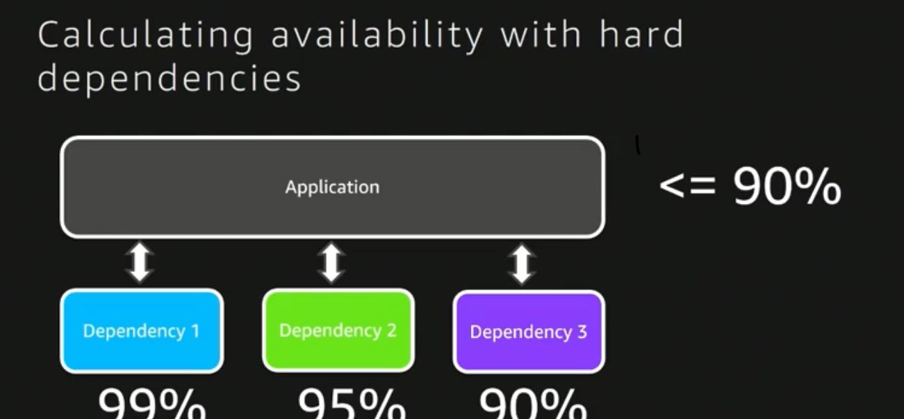

# Networking infrastructure design

## THE TYPES OF NETWORKS

- LAN(Local Area Network)
- PAN(Personal Area Network)
- MAN(Metropolitan Area Network)
- WAN(Wide Area Network)
- SAN(Strong Area Networking)

[Types of Computer Network](https://www.guru99.com/types-of-computer-network.html)

## Internetworking
Before discussing about the terms internet, intranet and extranet, we need to discuss the term Internetwork.

An internetwork can be defined as two or more computer networks (typically Local Area Networks LAN) which are connected together, using Network Routers.

Each network in an Internetwork has its own Network Address, which is different from other networks in the Internetwork. Network Address is used to identify the networks inside an Internetwork.

Internetwork allows different users at different geographical locations of an organization to share data, resources and to communicate. Modern businesses cannot even function without Internetwork. Internet, Intranet and Extranet are different types of internetwork.

- Internet
- Intranet
- Externet

[Basic Networking](https://www.omnisecu.com/basic-networking/internet-intranet-and-extranet.php)
  
[Difference Between Inter, Intra, Exter](https://www.geeksforgeeks.org/difference-between-internet-intranet-and-extraneNetwork)

## Network architecture refers to the way network devices and services are structured to serve the connectivity needs of client devices.

- Network devices typically include switches and routers.
- Types of services include DHCP and DNS.
- Client devices comprise end-user devices, servers, and smart things.

[What is Network Architecture?](https://www.cisco.com/c/en/us/solutions/enterprise-networks/what-is-network-architecture.html)

>All networks face different security threats, which they need to guard against.

## TYPES OF NETWORK ARCHITECTURE
- Peer to Peer
- Client/Server Architecture
  
*All network types have unique architectures*

- Two-tier model
  
- Three-tier model
  
- Enterprise campus: modularity

- Spine and Leaf
  

[Campus Network Design Links](https://www.networkcomputing.com/data-centers/campus-network-design-models)

[Spine Leaf Architecture](https://www.cisco.com/c/en/us/products/collateral/switches/nexus-7000-series-switches/white-paper-c11-737022.html#Spineandleafarchitecture)

[Cisco Enterprise Architecture Model ](https://www.ciscopress.com/articles/article.asp?p=2202410&seqNum=6)

[Cisco Live 2021](https://www.ciscolive.com/c/dam/r/ciscolive/us/docs/2021/pdf/learning-maps/Cisco-Live-2021-Learning-Maps-All.pdf)

### Youtube links 

[2 tire, 3 tire collapsed core network - South North Traffic](https://youtu.be/ZmLxb8HzQX4)

[Spine and Leaf network architecture - East Weast Traffic](https://youtu.be/xjc7WLBb-nI)

# System infrastructure design

## Operating System 
- Windows Server
- Linux Server
- macOS Server
  
[Best Linux Servers](https://www.tecmint.com/10-best-linux-server-distributions/)

## Server Hardware
- Dell
- HPE 
- HP
- Fujusu
- Huawei 
  
[Best Servers Hardware](https://www.g2.com/categories/servers)

## Server Infrastructure Design 

[System Design - github](https://github.com/donnemartin/system-design-primer)

[IT Infrastructure Design Link](https://www.mcleanit.ca/services/it-infrastructure-design/)

[ICAA5044C Develop system infrastructuredesign plan](https://training.gov.au/TrainingComponentFiles/ICA05/ICAA5044C_R1.pdf)

# Data Center

### Data Center Infrastructure

- Power Plan
- Floor Plan
- UPS System
- Cooling System
- Monitoring System

[Modular Data Center](https://www.deltapowersolutions.com/en/mcis/technical-article-modular-data-centers-the-rise-and-the-advantages.php)

[A VM and Cloud Hardware](https://crmtrilogix.com/Cloud-Blog/IaaS-and-PaaS/Cloud-Infrastructure--Data-Center-Architecture/160)

[NIH Sustainable Data Center Design Guide_508](https://www.orf.od.nih.gov/TechnicalResources/documents/nih%20sustainable%20data%20center%20design%20guide_508.pdf)

[Data Center Training](https://www.schneideruniversities.com/catalog/college/2)

**E-Books for Data Center**

[1 Data Center Physical Infrastructure Optimizing Business Value](./pdf/1%20Data%20Center%20Physical%20Infrastructure%20Optimizing%20Business%20Value.pdf)

[2 Virtualization Virtualization ](./pdf/2%20Virtualization%20Virtualization%20.pdf)

[3 Creating Order from Chaos in Data ](./pdf/3%20Creating%20Order%20from%20Chaos%20in%20Data%20.pdf)

[4 Guidelines for Specification of Data ](./pdf/4%20Guidelines%20for%20Specification%20of%20Data%20.pdf)

[5 Data Center Projects Standard Process](./pdf/5%20Data%20Center%20Projects%20Standard%20Process.pdf)

[6 Data Center Projects Project Management](./pdf/6%20Data%20Center%20Projects%20Project%20Management.pdf)

[7 Data Center Projects System Planning](./pdf/7%20Data%20Center%20Projects%20System%20Planning.pdf)

[8 Data Center Projects Growth Model](./pdf/8%20Data%20Center%20Projects%20Growth%20Model.pdf)

[9 Data Center Projects Establishing a Floor Plan](./pdf/8%20Data%20Center%20Projects%20Growth%20Model.pdf)

[10 The Different Types of UPS Systems](./pdf/10%20The%20Different%20Types%20of%20UPS%20Systems.pdf)

[11 Calculating Total Power  Requirement for Data Centers](./pdf/11%20Calculating%20Total%20Power%20%20Requirement%20for%20Data%20Centers.pdf)

[12 Watts and Volt-Amps  Powerful ](./pdf/12%20Watts%20and%20Volt-Amps%20%20Powerful%20.pdf)

[13 The Seven Types of Power Problems](./pdf/13%20The%20Seven%20Types%20of%20Power%20Problems.pdf)

[14 A Quantitative Comparison of  High Efficiency AC vs. DC Power  Distribution for Data Centers ](./pdf/14%20A%20Quantitative%20Comparison%20of%20%20High%20Efficiency%20AC%20vs.%20DC%20Power%20%20Distribution%20for%20Data%20Centers%20.pdf)

[15 How and Why Mission-critical  Cooling Systems Differ from  Common Air Conditioners ](./pdf/15%20How%20and%20Why%20Mission-critical%20%20Cooling%20Systems%20Differ%20from%20%20Common%20Air%20Conditioners%20.pdf)

[16 The Different Types of AirDistribution for IT Environments ](./pdf/16%20The%20Different%20Types%20of%20AirDistribution%20for%20IT%20Environments%20.pdf)

[17 Fundamental Principles of  Air Conditioners for  Information Technology ](./pdf/17%20Fundamental%20Principles%20of%20%20Air%20Conditioners%20for%20%20Information%20Technology%20.pdf)

[18 The Different Technologies for  Cooling Data Centers ](./pdf/18%20The%20Different%20Technologies%20for%20%20Cooling%20Data%20Centers%20.pdf)

[19 Choosing Between Room, Row, and Rack-based Cooling for Data Centers](./pdf/19%20Choosing%20Between%20Room,%20Row,%20and%20Rack-based%20Cooling%20for%20Data%20Centers.pdf)

[20 High-Efficiency AC Power  Distribution for Data Centers ](./pdf/20%20High-Efficiency%20AC%20Power%20%20Distribution%20for%20Data%20Centers%20.pdf)

# Security
### Security Framework
[NIST Cyber Security Framework](https://www.ifsecglobal.com/cyber-security/a-guide-to-the-nist-cyber-security-framework/)

[CIS](https://www.cisecurity.org/)

[PCI Security Standards](https://www.nist.gov/system/files/documents/2017/06/05/040813_pci_security_standards_council.pdf)

### Other Resources

[IDS - IPS](https://www.sciencedirect.com/topics/computer-science/network-based-intrusion-detection-system)

[Cisco NetworkSecurity](https://www.cisco.com/c/en/us/td/docs/solutions/Verticals/CPwE/5-1/Network_Security/WP/CPwE-5-1-NetworkSecurity-WP.pdf)

# High Avaiability 

## High Avaiability

## Disaster Recovery

## Calculating Avaiability with Hard Dependencies 

## Calculating Avaiability with Redudant Component

## AWS Offer four levels of Disaster Recover

## Building a Hyper-Avaiable Solutions 

[RPO-RTO-MTD](https://tandem.app/blog/what-is-the-difference-between-rpo-rto-mtd)

[RPO-RTO-WRT-MTD](http://virtualization24x7.blogspot.com/2015/11/what-is-rpo-rto-wrt-mtd.html)

## Building a Hyper-Avaiable Solutions 

## Data Center Tiers

[AWS - github ](https://github.com/binhnguyennus/awesome-scalability)

# Scalability

- Vertical scaling or scale up
- Horizontal scaling or scale out

[Scalability](https://faun.pub/scalability-248019b918ed)
  
[Cloud automation](https://cloudcheckr.com/cloud-automation/horizontal-vertical-cloud-scaling/)  

[Scalability - Wikipidia](https://en.wikipedia.org/wiki/Scalability)

[Scaling Up Vs Out](https://www.section.io/blog/scaling-horizontally-vs-vertically/)

# Blockchain

[Blockchain](https://en.wikipedia.org/wiki/Blockchain)

# DevOps

[What is DevOps](https://www.guru99.com/devops-tutorial.html)

[Nana Devops Bootcamp](https://www.techworld-with-nana.com/devops-bootcamp)

[KodeKloud](https://kodekloud-engineer.com/)

### Other Resources

[The Book of Secret Knowledge - github](https://github.com/trimstray/the-book-of-secret-knowledge)

[Devops Exercises](https://github.com/bregman-arie/devops-exercises)

[Open Source Devops Tools](https://devops.com/11-open-source-devops-tools-we-love-for-2021/)

[Cloud Native](https://www.cncf.io/)

### Youtube links 

[DevOps Roadmap 2021 - How to become a DevOps Engineer?](https://youtu.be/9pZ2xmsSDdo)

[Myanmar DevOps Interview](https://youtu.be/xO1SkBWviH8)

# Online Training Website

## Infrastructures and Operations 

[Techworld-with-nana](https://www.techworld-with-nana.com/devops-bootcamp)

[A Cloud Guru](https://acloudguru.com/)

[Kodekloud](https://kodekloud.com/learning-path-devops-basics/)

[Pluralsight](https://www.pluralsight.com/)

## Developer 

[Laracasts](https://laracasts.com/)

[treehouse](https://teamtreehouse.com/)

# IT Porject Management

- ITIL
- Waterfall
- Agils
- DevOps

